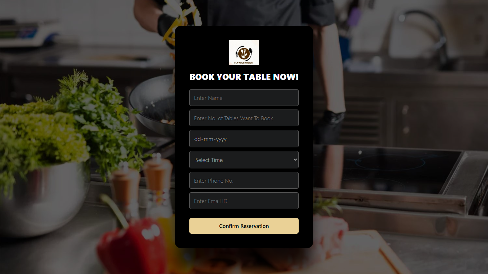

# 🍽️ Flavour Fusion - Restaurant Website

This is a full-featured restaurant website for **Flavour Fusion**, offering online table reservations, menu browsing, chef profiles, and more.

---

## 📁 Project Structure

<pre> ```bash /Restaurant-_FrontEnd/ │ ├── assets/ │ ├── css/ │ │ └── reservation.css │ ├── images/ │ │ └── reservation-screenshot.png ← 📸 Preview image │ ├── js/ │ │ └── script.js │ ├── table.php ← Combined form + logic ├── cancel.php ← Cancel Reservation ├── index.html ← Homepage ├── chefs.html ← Meet Our Chefs ├── menue.html ← Delicious Menu ├── restaurant_db.sql ← 📦 SQL file to create database and table ``` </pre>


---

## 🚀 Features

- 🗞️ Table reservation system (with availability check)
- 📜 Stylish and responsive menu cards
- 👨‍🍳 Chefs profile section
- 🗺️ Integrated Google Maps link
- 📦 Toast notifications for reservation success/error
- 🎨 Fully responsive layout with animations

---

## 🛠️ Tech Stack

- HTML5, CSS3
- PHP (backend logic)
- MySQL (database)
- JavaScript (minimal usage)
- Ionicons & Google Fonts

---

## 🗃️ How to Setup

1. Install [XAMPP](https://www.apachefriends.org/)
2. Clone or download this project
3. Place it inside htdocs folder (C:/xampp/htdocs/Restaurant-_FrontEnd)
4. Import restaurant_db.sql into phpMyAdmin:
   - Go to http://localhost/phpmyadmin
   - Click "Import"
   - Choose restaurant_db.sql
   - Click "Go"
5. Start Apache and MySQL in XAMPP
6. Visit http://localhost/Restaurant-_FrontEnd/

---

## 📌 Notes

- Max 10 tables are allowed per time slot
- Past dates are disabled in the date picker
- Phone number must be 10 digits

---

## 📷 Preview



---

## 👨‍💼 Developed By

- Jadhav Trupti
- Tambe vidya 